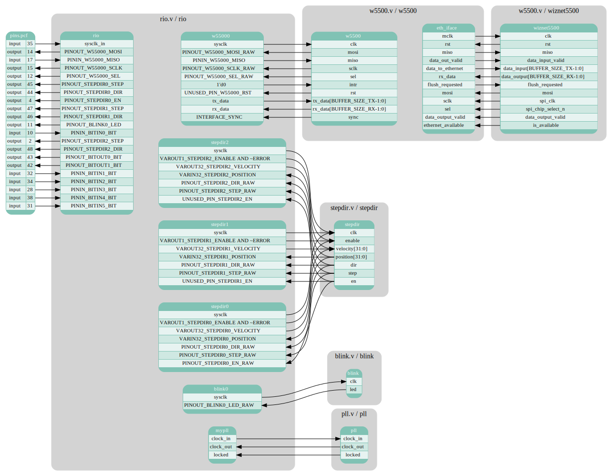

# Example-Output

https://cserver1.multixmedia.org/verilog2doc/




# Quickstart
```
$ python3 verilog2doc.py ../riocore/Output/ICEBreakerV1.0e/Gateware/board0/*.v
FALLBACK: setting top module to 'rio'
setting output directory to ../riocore/Output/ICEBreakerV1.0e/Gateware/board0/Documentation
using pin-file: ../riocore/Output/ICEBreakerV1.0e/Gateware/board0/pins.pcf
```
